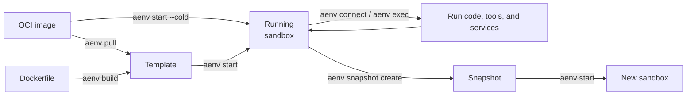
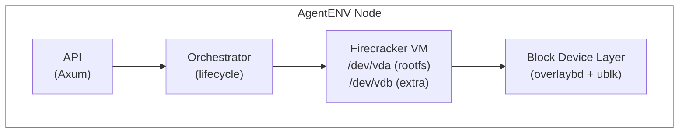

# How AgentENV Works

AgentENV runs AI agents and their tools inside isolated, snapshot-capable Linux
environments. Each environment, called a **sandbox**, is backed by a Firecracker
microVM with its own kernel, filesystem, processes, and network stack.

## User Workflow

A typical workflow is:

1. Create a reusable template from an OCI image or Dockerfile.
2. Start an isolated sandbox from the template, or cold start one directly
   from an OCI image.
3. Run command in the sandbox.
4. Pause the sandbox when you want to preserve the same sandbox for later, or
   create a snapshot when you want a reusable checkpoint that can launch new
   sandboxes.
5. Delete sandboxes and snapshots when they are no longer needed.

## Templates, Sandboxes, and Snapshots

These three concepts describe the reusable and running forms of an environment:

| Concept | Purpose |
|---|---|
| **Template** | A named, reusable starting point used to launch sandboxes. A template build produces a committed snapshot underneath. |
| **Sandbox** | A running, isolated Linux environment where you execute code, modify files, and start services. |
| **Snapshot** | A durable checkpoint captured from a sandbox. It can be started repeatedly to create new sandboxes with the captured state. |

- Building a template produces a snapshot-backed starting point.
- Starting a template or snapshot creates a sandbox.
- Capturing a running sandbox creates a snapshot without replacing the source
  sandbox.

## System Overview

## Request Flow

1. A client sends an HTTP request to the AgentENV API (for example,
   `POST /sandboxes`).
2. The **API layer** validates the request, checks authentication, and forwards
   it to the **orchestrator**.
3. The **orchestrator** manages the sandbox lifecycle: it creates a Firecracker
   VM, sets up networking, and attaches block devices.
4. The VM boots with a **layered block device** (overlaybd) that stacks read-only
   base image layers with a writable upper layer. Multiple sandboxes share the
   same base layers.
5. Inside the VM, an **envd** daemon handles command execution, file operations,
   and health reporting.
6. Clients interact with running sandboxes via the **reverse proxy** (`/proxy`,
   routing headers, or configured sandbox proxy domains), which forwards HTTP
   and WebSocket traffic to services inside the VM.

Continue with [Templates](./templates.md), [Sandboxes](./sandboxes.md), and
[Snapshots](./snapshots.md) for the commands and options for each workflow.
