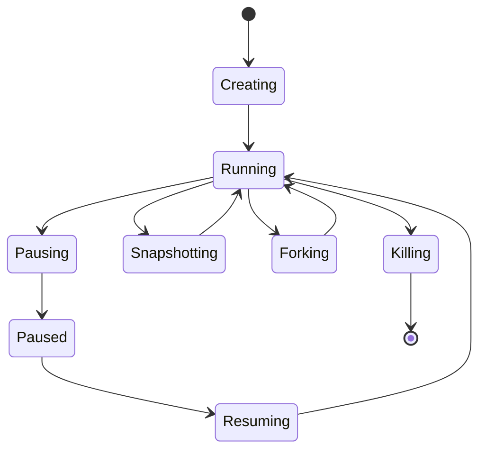
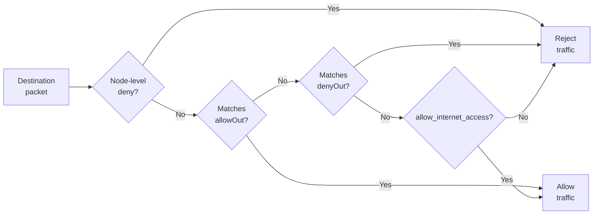

# Sandboxes

A sandbox is an isolated Firecracker microVM with its own Linux kernel,
filesystem, processes, and network stack. It is the environment where you run
code, use tools, modify files, and start services.

## Lifecycle



| State | Description |
|-------|-------------|
| **Creating** | VM is booting, block devices are being attached, networking is being configured |
| **Running** | VM is ready. Commands can be executed, proxy traffic is routed, timeout is ticking |
| **Pausing** | Memory and disk snapshots are being captured |
| **Paused** | VM is stopped. Snapshot artifacts are stored. No resources consumed |
| **Resuming** | Sandbox is being restored from its paused snapshot |
| **Snapshotting** | A persistent snapshot is being captured; sandbox returns to Running after |
| **Forking** | Sandbox is being cloned into child sandboxes; source returns to Running after |
| **Killing** | VM is being torn down and resources released |

---

## Starting a Sandbox

You can start a sandbox from a reusable template or snapshot, or cold start one
directly from an OCI image.

### From a Template or Snapshot

Pass either a template/snapshot alias or its ID:

Usage:

```bash
aenv start <template-or-snapshot> [options]
```

Example:

```bash
# Start by alias
aenv start my-python-template

# Start by ID
aenv start 018f0d93-aaaa-bbbb-cccc-0123456789ab
```

Warm-start options:

| Argument or option | Default | Description |
|---|---|---|
| `<template-or-snapshot>` | Required | Template or snapshot ID or alias. |
| `--secure` | Off | Require an envd access token for command and file operations. The CLI manages the token automatically; see [Authentication](./authentication.md#secure-sandbox-authentication). |
| `--timeout <seconds>` | `300` | Set the sandbox TTL. The sandbox auto-pauses when it reaches the TTL; see [Auto-Eviction](#auto-eviction). |
| `-d`, `--detach` | Off | Print the sandbox ID and exit instead of attaching an interactive shell. |

Without `--detach`, `aenv start` waits for the sandbox to become ready and then
attaches an interactive shell. CPU, memory, and disk settings are inherited
from the template or snapshot and cannot be overridden on a warm start.

To retrieve the current state and configuration of one sandbox, use the HTTP
API:

```bash
curl -H 'X-API-Key: test-key' \
  http://127.0.0.1:8000/sandboxes/<sandbox-id>
```

### Cold Start from an OCI Image

A cold start resolves an OCI image directly and prepares a fresh writable root
filesystem at runtime:

Usage:

```bash
aenv start --cold <image> [options]
```

Example:

```bash
aenv start --cold ubuntu:24.04
aenv start --cold ubuntu:24.04 --cpu 4 --memory 4096 --disk-size-mb 65536
```

Cold-start options:

| Argument or option | Default | Description |
|---|---|---|
| `<image>` | Required | External OCI image reference. |
| `--cold` | Required for an OCI image | Cold start directly from `<image>`. |
| `--secure` | Off | Require an envd access token for command and file operations. The CLI manages the token automatically; see [Authentication](./authentication.md#secure-sandbox-authentication). |
| `--timeout <seconds>` | `300` | Set the sandbox TTL. The sandbox auto-pauses when it reaches the TTL; see [Auto-Eviction](#auto-eviction). |
| `--cpu <count>` | `[machine].vcpu_count` from your AgentENV config file | Set the sandbox's vCPU count. Alias: `--cpu-count`. |
| `--memory <MiB>` | `[machine].mem_size_mib` from your config file | Set sandbox memory. Aliases: `--memory-mb`, `--mem`. |
| `--disk-size-mb <MiB>` | Source image virtual size | Set root filesystem size. The value must be greater than zero and divisible by 1024 MiB. Alias: `--disk-mb`. |
| `-d`, `--detach` | Off | Print the sandbox ID and exit instead of attaching an interactive shell. |

The AgentENV config file is `config/default.toml` by default, or the file
specified by `AENV_CONFIG_PATH`.

An OverlayBD-native image can start without downloading
the complete image first; its filesystem data is loaded from the registry on
demand. See [On-Demand Loading](../getting-started/on-demand-loading.md).

Growth of the disk size is allowed by
default. Shrinking below the source image size requires
`ublk.overlaybd.allow_shrink = true` in your AgentENV config file. Resizing
applies only when creating a fresh writable root filesystem, not to read-only
images, images with an existing upper layer, or snapshot resume. Sandbox
responses report the effective size as `diskSizeMB`.

## Working with Sandboxes

### Connect to a Sandbox

`aenv connect` opens an interactive shell inside the sandbox and attaches your
terminal. `aenv cn` is its short alias:

```bash
aenv connect <sandbox-id>
aenv cn <sandbox-id>
```

If a sandbox is paused, `aenv connect` will automatically resume it.

### Execute a Command

`aenv exec` runs one non-interactive command, streams its output to your local
terminal, and exits with the remote command's exit code. It does not attach an
interactive shell.
Flags intended for the remote command
that collide with aenv's own flags can be escaped with a leading `--`.

```bash
aenv exec <sandbox-id> ls -la /
aenv exec <sandbox-id> -- command-with-aenv-like-flags --timeout 10
```

### Upload Files

`aenv upload` copies a local file or directory into a running sandbox:

Usage:

```bash
aenv upload <sandbox-id> <local-path> <remote-path> [options]
```

Example:

```bash
aenv upload 018f0d93-aaaa-bbbb-cccc-0123456789ab ./config.json /workspace/config.json
```

| Argument or option | Default | Description |
| --- | --- | --- |
| `<sandbox-id>` | Required | ID of the destination sandbox. |
| `<local-path>` | Required | Local file or directory to upload. |
| `<remote-path>` | Required | Destination inside the sandbox. Directory paths must be absolute. |
| `--user <user>` | None | Resolves a relative remote file path from this user's home directory and sets the uploaded file's owner. It is not supported for directory uploads. |

### Download Files

`aenv download` copies a file or directory from a running sandbox to your local
machine:

Usage:

```bash
aenv download <sandbox-id> <remote-path> [local-path] [options]
```

Example:

```bash
aenv download 018f0d93-aaaa-bbbb-cccc-0123456789ab /workspace/result.txt ./result.txt
```

| Argument or option | Default | Description |
| --- | --- | --- |
| `<sandbox-id>` | Required | ID of the sandbox to download from. |
| `<remote-path>` | Required | File or directory inside the sandbox. Directory paths must be absolute. |
| `[local-path]` | Current directory | Local destination file or directory. |
| `--user <user>` | None | Resolves a relative remote file path from this user's home directory. It is not supported for directory downloads. |
| `--force` | Disabled | Replaces conflicting local files. Without it, the download stops instead of overwriting them. |

### Pause and Resume

Pausing saves the sandbox's current runtime state and stops its microVM. While
it is paused, programs inside it do not run, services do not handle requests,
and the sandbox releases its CPU and memory resources. Its saved state remains
in storage so the same sandbox can be resumed later.

After resume, the filesystem, running processes, environment variables, and
in-memory data are restored to the state captured at pause time. Programs
continue from that saved state instead of starting again from the beginning.

```bash
aenv pause <sandbox-id>
aenv resume <sandbox-id>
aenv resume <sandbox-id> --timeout 600
```

`aenv resume` accepts `--timeout <seconds>`, which defaults to 300 seconds and
sets the new TTL from resume time.

By default, the sandbox automatically pauses when it reaches its TTL. See
[Auto-Eviction](#auto-eviction) for how the deadline is set and how to delete
instead of pause.

### Persistent Snapshots

A snapshot is a durable, reusable checkpoint of a running sandbox. Creating one
does not replace the sandbox: the source returns to Running after capture, and
the snapshot can later launch one or more new sandboxes.

```bash
aenv snapshot create <sandbox-id>
aenv snapshot create <sandbox-id> --name my-base
```

The resulting snapshot appears in `aenv snapshot list` and can be started with
`aenv start <snapshot-id-or-name>`. See [Snapshots](./snapshots.md) for its
parameters and lifecycle.

### Fork

Forking clones a running sandbox into independent child sandboxes on the same
node. The source is briefly paused while its state is captured, then returns to
Running. Children inherit the source filesystem, memory, network policy,
security mode, and CPU/memory/disk configuration. All children use one captured
state, but each child can succeed or fail independently.

```bash
curl -X POST \
  -H 'X-API-Key: test-key' \
  -H 'Content-Type: application/json' \
  -d '{"count": 3, "timeout": 600}' \
  http://127.0.0.1:8000/sandboxes/<sandbox-id>/fork
```

| Field | Default | Description |
|---|---|---|
| `count` | `1` | Number of children to create; minimum 1, maximum 100. |
| `timeout` | Source sandbox's TTL duration | TTL for each child, measured from the fork time. |

A successful request returns an array with one result for each requested child.
Each entry contains either a `sandbox` object—including its `sandboxID`—or an
`error` explaining why that individual child failed. It is not a plain list of
IDs. A non-201 response means the request failed before any child was attempted.
See the [API Reference](../api/index.md) for the complete fork request and
response schemas.

### Manage Sandboxes

List sandboxes:

```bash
aenv list
aenv list --output json
```

`--output` accepts `table` or `json`. It defaults to a table in an interactive
terminal and JSON when output is piped or redirected.

Delete a sandbox:

```bash
aenv delete <sandbox-id>
```

Deletion is permanent, but snapshots previously created from the sandbox are
unaffected.

## Auto-Eviction

Every running sandbox has a time-to-live (TTL). The TTL establishes an
expiration deadline so a sandbox cannot occupy CPU and memory indefinitely.
When the TTL is reached,
AgentENV automatically pauses or deletes the sandbox so those resources can be
reclaimed.

### Behavior at Expiration

When a sandbox reaches its TTL, AgentENV performs its configured timeout
action:

- **Pause** (`autoPause: true`, the default): preserve the sandbox so it can be
  resumed later.
- **Delete** (`autoPause: false`): permanently remove the sandbox.

The timeout action is selected when the sandbox is created. The `aenv start` command uses the default action,
`autoPause: true`. To delete on expiration instead, create the sandbox through
the API with `autoPause: false`.

Warm start from a template or snapshot:

```bash
curl -X POST \
  -H 'X-API-Key: test-key' \
  -H 'Content-Type: application/json' \
  -d '{
    "templateID": "my-template",
    "timeout": 600,
    "autoPause": false
  }' \
  http://127.0.0.1:8000/sandboxes
```

Cold start from an OCI image:

```bash
curl -X POST \
  -H 'X-API-Key: test-key' \
  -H 'Content-Type: application/json' \
  -d '{
    "image": "ubuntu:24.04",
    "timeout": 600,
    "autoPause": false
  }' \
  http://127.0.0.1:8000/sandboxes-cold
```

### Set or Extend the Deadline

`aenv start --timeout <seconds>` sets the initial TTL. If an automatically
paused sandbox is needed again, `aenv resume --timeout <seconds>` resumes it and
sets a new TTL from the resume time. Both commands default to 300 seconds.

For a running sandbox, replace its deadline with an exact number of seconds
from now:

```bash
aenv timeout <sandbox-id> 600
```

This sets the deadline to 600 seconds from the time the command is sent.
Calling it again replaces the previous deadline, so it can either extend or
shorten the remaining time.

To keep a running sandbox alive without shortening a later existing deadline,
use the refresh API:

```bash
curl -X POST \
  -H 'X-API-Key: test-key' \
  -H 'Content-Type: application/json' \
  -d '{"duration": 600}' \
  http://127.0.0.1:8000/sandboxes/<sandbox-id>/refreshes
```

Refresh does not shorten the remaining TTL if the current deadline is
later. Refresh applies only to a running sandbox; resume a paused sandbox
first. If `duration` is omitted, the server's default sandbox timeout is used.

`aenv connect` resumes a paused sandbox when it connects and ensures that its
TTL is at least the default 300 seconds.

## Networking

Each sandbox has an isolated network stack. Networking controls two separate
boundaries:

- **Egress:** which IP addresses, CIDRs, and domains the sandbox can connect to.
- **Ingress:** whether services exposed through the AgentENV proxy are public
  or require the sandbox traffic access token.

### What You Can Configure

| Field | Default | Meaning |
|---|---|---|
| `allow_internet_access` (warm) / `allowInternetAccess` (cold) | `true` | Base egress policy. `false` rejects destinations not explicitly allowed. |
| `network.allowOut` | Empty | Egress exceptions expressed as IPv4 CIDRs, IPs, or domain patterns. |
| `network.denyOut` | Empty | IPv4 CIDRs or IPs to reject. Domain names are not supported here. |
| `network.allowPublicTraffic` | `true` | Per-sandbox creation setting controlling whether proxied services are public. When `false`, requests require the sandbox's traffic access token. |

Node-wide egress denials are configured separately with
`[network.egress].always_denied_cidrs` in your AgentENV config file. This lists
IP ranges that every sandbox is prohibited from reaching, such as private or
host-local networks. These rules are applied before per-sandbox rules and
cannot be overridden by `allowOut`.

```toml
[network.egress]
always_denied_cidrs = [
  "10.0.0.0/8",
  "169.254.0.0/16",
]
```

### Matching Rules

Rules are evaluated in this order:



`allowOut` can override an overlapping user-configured `denyOut`, but it cannot
override node-level internal/reserved-network deny rules. Setting
`allow_internet_access: false` adds a deny-by-default base policy after the
explicit rules.

Domain names can be used only in `allowOut` for HTTP/HTTPS connections. Exact
names and wildcard forms such as `*.example.com` are supported. If `allowOut`
contains a domain, also set `denyOut` to `["0.0.0.0/0"]`; this blocks other
destinations and leaves the listed domains as the allowed exceptions.

### Configure at Creation

Both warm and cold sandbox creation support network policy.

Warm start from a template or snapshot:

```bash
curl -X POST \
  -H 'X-API-Key: test-key' \
  -H 'Content-Type: application/json' \
  -d '{
    "templateID": "my-ubuntu",
    "network": {
      "allowOut": ["*.example.com"],
      "denyOut": ["0.0.0.0/0"],
      "allowPublicTraffic": false
    }
  }' \
  http://127.0.0.1:8000/sandboxes
```

Cold start from an OCI image:

```bash
curl -X POST \
  -H 'X-API-Key: test-key' \
  -H 'Content-Type: application/json' \
  -d '{
    "image": "ubuntu:24.04",
    "allowInternetAccess": false,
    "network": {
      "allowOut": ["8.8.8.8/32"]
    }
  }' \
  http://127.0.0.1:8000/sandboxes-cold
```

### Update a Running Sandbox

Replace the egress policy of a running sandbox:

```bash
curl -X PUT \
  -H 'X-API-Key: test-key' \
  -H 'Content-Type: application/json' \
  -d '{"allowOut": ["8.8.8.8/32"], "denyOut": ["0.0.0.0/0"]}' \
  http://127.0.0.1:8000/sandboxes/<sandbox-id>/network
```

The update replaces the current egress rules. Omitting both `allowOut` and
`denyOut` clears the per-sandbox lists; omit `allow_internet_access` as well to
restore the default base policy.

In the current implementation, updates primarily affect new connections and do
not actively terminate existing ones. For domain-policy replacement, the old
policy remains active until the new namespace rules are installed and the new
proxy policy is activated.
